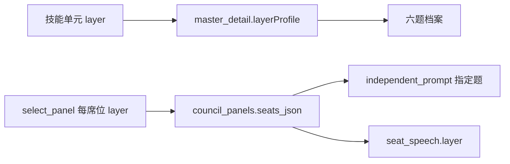

# 思想熔炉 · 六题会诊 · 技术设计

## 1. 轴的定义变化

| | 改轴前 | 改轴后 |
|---|---|---|
| 层回答的问题 | 这位大师属于哪一类 | 这一题他有没有话说 |
| 层的归属者 | 大师（每人 1 至 2 层） | 技能单元（一单元一题） |
| 大师的层 | 手写声明，选角硬约束 | 由单元反推，是六题档案的汇总 |
| 冲突来源 | 人与人的词面与层集差异 | 同一题内两位大师的立场差异 |

轴的名字与枚举保持 `Layer` / 道法术气器势 不变，避免跨 130 余条命令、全部迁移与前端类型的大规模改名。语义变化写在文档与注释里。

## 2. 模块改动

### 2.1 `master`（六题档案）

`crates/core/src/master/mod.rs`

- 新增 `Layer::question(self) -> &'static str`，返回六题的核心问题，取值与前端 `src/domain/layers.ts` 的 `question` 字段逐字一致。
- 新增 `LayerProfile { layer: Layer, name: String, question: String, unit_count: i64, unit_titles: Vec<String> }`。
- `MasterDetail` 新增 `layer_profile: Vec<LayerProfile>`。

`crates/core/src/master/repo.rs`

- `detail()` 在装配 `units` 后按六题顺序汇总 `layer_profile`，只使用当前版本的技能单元，不额外查表。空缺题同样出现，`unit_count` 为 0。

### 2.2 `council`（席位锚定到题）

迁移 `0015_seat_questions.sql`：

```sql
ALTER TABLE council_panels ADD COLUMN seats_json TEXT NOT NULL DEFAULT '[]';
```

只新增列并带默认值，历史行读出为空数组。

`crates/core/src/council/mod.rs`

- 新增 `SeatRef { master_id: String, layer: Layer }`。
- `PanelView` 新增 `seats: Vec<SeatRef>`。`layers` 与 `gaps` 保留为派生摘要，读取路径不变。

`crates/core/src/council/repo.rs`

- `record_panel()` 写入 `seats_json`，与 `master_ids` 同序。
- `panels()` 读取 `seats_json`；为空时回退为「按 master_ids 顺序取各自声明层次的最靠抽象端一层」，与旧行为一致。
- `copy_panel()` 一并复制 `seats_json`。

`crates/core/src/council/select.rs`

- 选角结果已是每席位带 `layer`，`record_panel` 直接落库，选角算法本步不改。

`crates/core/src/council/orchestrator.rs`

- `independent_prompt(question, master, layer)` 增加 `layer` 参数，正文加入：
  - 「本轮你负责回答的是『{question}』（{layer}层）。」
  - 「请从你自己的技能单元出发回答这一问；若你的技能单元不足以回答这一问，直接说明不适用之处，不要套用不相干的框架。」
- `independent_prompt_with_sources` 透传 `layer`。
- `PROMPT_VERSION` 递增为 `2026-09-17.1`。
- 编排循环按 `panel.seats` 取该席位的题；映射缺失时回退 `primary_layer`。

`crates/core/src/council/speech.rs`

- `seat_speech()` 的 `layer` 改为读 `panel.seats`，不再用 `primary_layer` 重算，消除圆桌与逐席发言两处口径不一致；缺失映射时保留现有回退。
- `retry_seat()` 复用同一取层函数。

### 2.3 前端

- `src/domain/layers.ts`：新增 `layerDepth(units)`，返回按 `LAYER_KEYS` 顺序的 `{ key, count, titles }`。
- `src/realms/VaultRealm.tsx` 的 `MasterArchive`：在档案头之后、技能之前插入「六题档案」分区。每行一个题：几何标记 + 题名 + 核心问题 + 深浅条 + 单元名称；空缺行显示「这一题还没有积累」。
- `src/ipc/commands.ts`：`MasterDetail` 新增 `layerProfile`；`CouncilPanel` 新增 `seats`。
- `src/ipc/demoData.ts`：为六位大师补 `layerProfile`；为面板补 `seats`。
- `src/styles/shell.css`：新增 `.profile` / `.profile__row` / `.profile__bar` 等样式，沿用 `--layer-*` 令牌与几何标记，深色对比度符合基线。

## 3. 数据流



## 4. 后续两步的接口预留（已在第 5、6 节落地）

- 同题对立：`scoring` 增加按题分组的对立度函数，输入为「题 + 两位大师在该题下的单元文本」，仍然离线预计算存 `master_pairings` 的扩展表。
- 按题换批：`Selection` 的 `gaps` 语义从「无大师的层」扩展为「有争议或缺席的题」，`select` 的补位目标改为缺口题集合。两者都在本步的 `seats` 之上做，不再改列。

## 5. P18 同题对立与按题换批

迁移 `0016_layer_pairings.sql` 新增 `master_layer_pairings(master_a_id, master_b_id, layer, opposition_score, computed_at)`，按 (大师对, 题) 存对立度；`pairings::recompute` 一次写两张表，安装大师包即重算。

`scoring` 抽出 `layer_gap`，新增 `layer_opposition`：0.7 × 词面差异 + 0.3 × 层次框架差异，只用该题下的单元文本；任一方在该题没有积累时退回整体对立度，避免把「没积累」误判为「最对立」。`pool` 把单元按题分组成 `MasterText.layer_tokens`。

`SelectionRequest` 增加 `previous: &[SeatRef]` 与 `diverged: &[Layer]`。碰撞策略补某一题时，优先选与该题上一任对立度最高的人；没有上一任时退回与已入席者的整体对立度。缺口题口径为三条：该题无人站上、全池该题候选不足两位、上一轮在该题没谈拢（命令层从会话的分歧清单读出）。

分歧从纯文本升级为 `DivergenceView { layer, text }`：同题内差异最大的一对必出一条，与全场其余席位差异最大的一位按其所在题再出一条；旧库里的纯文本历史分歧读回时回填到「法」。

缺口题不再只留在内核与类型里：会诊界面在圆桌上给对应席位加虚线边框与「这一题还要再谈」标记，并单独列出「还要再谈的题」分区，逐个写出题名与核心问题。文案对三种成因保持中性（无人站上、能谈的人不到两位、上一轮没谈拢），因为缺口清单只有题名，分辨不出具体哪一种；有两位站上却没谈拢的题同样会出现在这里，所以不能写成「缺人」。标记同时靠边框与文字表达，不依赖颜色单通道。

一届圆桌的一题可以同时站上两位大师：库里没有任何一位谈某一题的大师时，补位会把多出来的人放到已有人站上的题，同题对立因此有了来源。圆桌的席位卡因此按「人」列出全部站上该题者，各自带契合度与锁定按钮，避免只渲染第一位而漏人；卡上同时标出「同一题上有 N 位」。

## 6. P19 记录按题累积

迁移 `0017_seat_stances.sql` 新增 `council_stances(session_id, panel_rotation, master_id, master_name, layer, summary, created_at)`，主键 (session_id, panel_rotation, master_id)。

`repo::record_stances` 在 `finish_session` 与 `mark_cancelled` 末尾执行：取每个席位在最后一轮的成功发言（不含收敛裁决），截第一句、上限 80 字作为立场摘要，纯本地推导，不额外调用模型。断点续跑后重跑收尾按主键更新。

`conclusion_view` 新增 `stance_changes`：按写入顺序往前找第一场题面归一化一致的会诊，逐题比较两轮摘要的用词重合度。重合度不低于 0.6 记「延续」，低于 0.25 记「转向」，其间记「调整」；本轮才有该题记「新谈」，仅上一轮有记「停谈」。找不到可比记录（升级前会话、首次会诊）时返回空表，界面隐藏该段。

前端在结论第「六 · 前后几次结论」段内按题列出变化与上一轮原文，变化一律带文字标签，不靠颜色单通道表达。

立场变化按题呈现：一题站了两位时，两位的摘要都会落库，比较时按题取席位写入顺序里的第一位，因此该题只出一条变化。这是刻意的——R6.2 问的是「每题上的立场变化」，一题两行会让同一题在结论里出现两次。

## 7. 验收

- Rust：`tests/masters.rs` 断言 `layerProfile` 的题序、计数与空缺；`tests/council.rs` 断言 `seats` 落库后逐席发言的题与圆桌一致、历史面板回退可用；提示词用例断言第一轮正文包含被指派的题。
- 前端：`VaultRealm.test.tsx` 断言「六题档案」分区、六行齐全与空缺提示；`CouncilRealm.test.tsx` 断言席位显示所属题。
- 门禁：core 全量、两个 crate clippy、`pnpm typecheck`、`pnpm test`、`pnpm build`。
