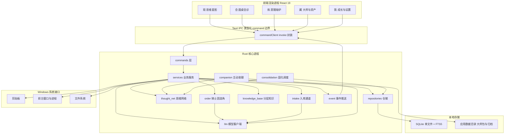
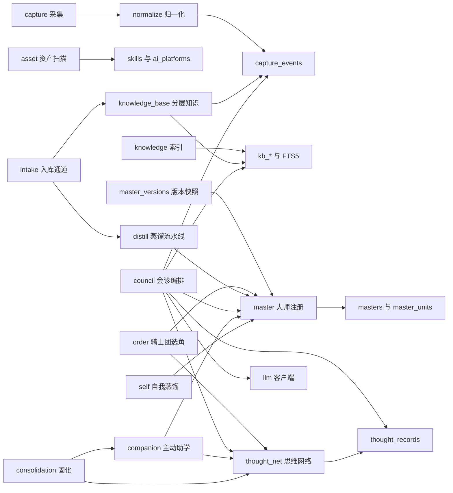
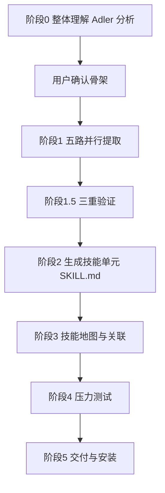
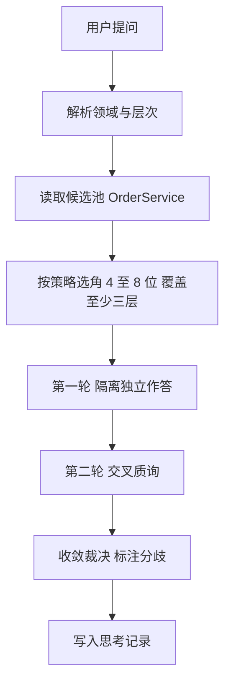
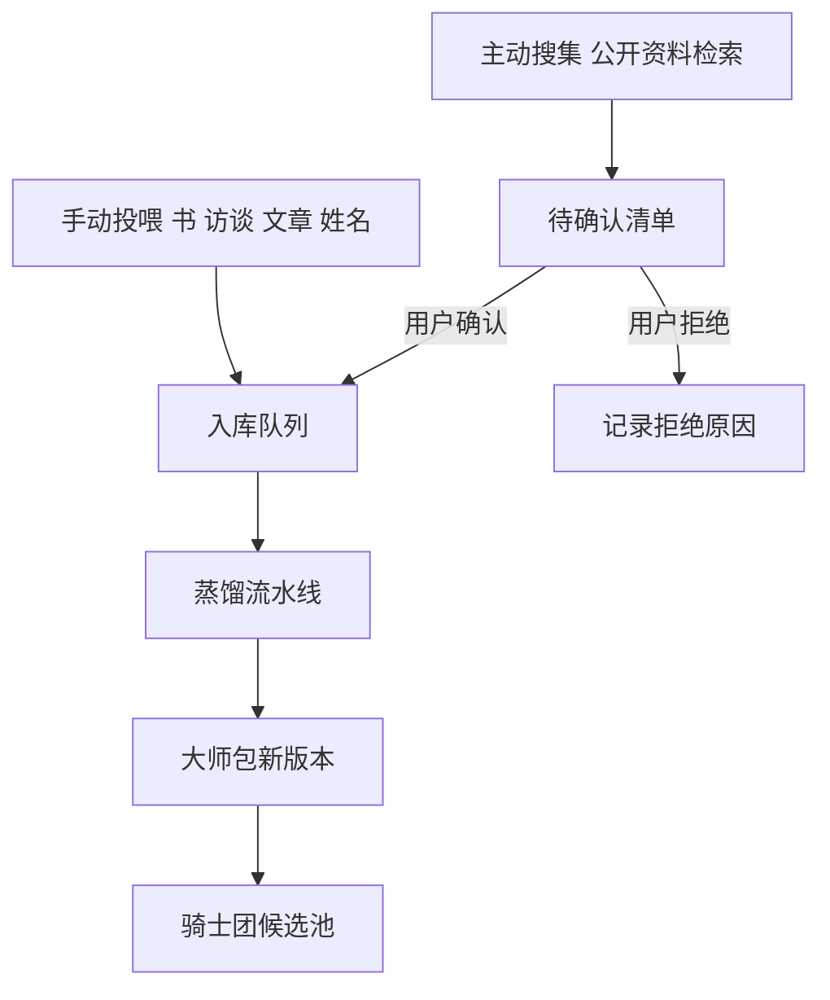
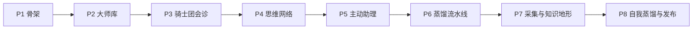

# 自我提升的思想熔炉 · 技术设计

Feature Name: thought-forge-workbench
Updated: 2026-09-14

## 描述

思想熔炉是一个本地优先的 Windows 桌面应用。它把用户本机的日常行为、剪贴板内容、已安装 Skill 与 AI 资产、本地知识库汇聚到同一套本地存储中，并在此基础上运行「大师会诊」：多位按领域与层次标注的大师围绕同一个问题独立作答、交叉质询，最终收敛为可执行判断，并沉淀为成长轨迹。

层次轴为道、法、术、气、器、势六层，分别承载价值判断、体系规律、操作技法、心力状态、工具载体与时机形势。器层回答「用什么工具做」「靠什么载体承载」「如何放大杠杆」，势层回答「现在是不是时候」「窗口期还有多久」。

工程即本仓库根目录，是独立交付物，拥有自己的依赖清单、构建脚本、测试与发布流程。工程不扩展其他工程的源码，也不把它们作为运行时依赖，只借鉴其中已验证的实现方式。

## 架构

### 进程与分层



### 技术栈

前端使用 React 19、TypeScript 5.9 严格模式、Vite 7、pnpm 10 与 Vitest。Rust 核心使用 Tauri 2、rusqlite 0.37（bundled SQLite）、serde、chrono、thiserror、sha2、uuid、notify 与 reqwest。Windows 平台接口经 `windows-sys` 调用。安装包使用 NSIS，WebView2 采用 bootstrapper。

工具链版本以能构建为准，不锁定过旧的小版本：当前传递依赖已要求 Cargo 的 edition 2024 支持，因此 Rust 使用 stable 通道而非固定的 1.77.2。纯逻辑内核独立成 `thought-forge-core` crate，不依赖任何界面系统库，可以在无 WebView 环境下直接 `cargo test`。

界面的完整视觉规范、导航模型、五个境界的场景设计与设计令牌见 `当前工作区/.monkeycode/specs/thought-forge-workbench/ui-design.md`。

### 模块边界



各模块只通过 Rust 服务接口与数据库交互。采集、索引、蒸馏与会诊互不直接依赖，会诊是唯一的同步编排方，思维网络是所有认知产出的汇聚层，主动助理与固化调度是网络之上的异步层。

## 组件与接口

### 采集服务 CaptureService

按能力开关采集四类事件：剪贴板文本、剪贴板图片引用、前台窗口与应用、文件打开与编辑。

- `get_capture_capabilities()` 返回各能力的当前开关与系统可用性。
- `set_capture_capability(kind, enabled)` 切换单项能力，写审计记录。
- `pause_capture()` 与 `resume_capture()` 全局暂停与恢复。
- `list_capture_events(filter, page)` 按类型与时间范围分页读取。
- `delete_capture_event(id)` 删除单条记录及其派生摘要。

剪贴板采用 800 毫秒轮询并计算内容哈希去重。前台窗口采用 2 秒采样，记录应用名、窗口标题与持续时长，同一窗口连续采样合并为一段。文件活动监听用户指定的受关注目录，使用 `notify` 递归监听并记录事件类型与路径。文件正文不被读取。

外壳落地（`src-tauri/src/capture.rs` 与 `src-tauri/src/capture_win.rs`）：

- 剪贴板与前台窗口经 `windows-sys` 取原始数据：剪贴板读 `CF_UNICODETEXT`，图片只记 `CF_DIB` 的格式与字节数作为引用；前台窗口取 `GetForegroundWindow` 的窗口标题与 `QueryFullProcessImageNameW` 的可执行文件名。两者都可能在占用或权限不足时失败，失败即跳过本轮并计入错误计数，不升级成错误码。
- 采样节奏由外壳掌握：`capture_collect` 每次触发时，剪贴板按 800 毫秒、前台窗口按 2 秒判定是否到达最小间隔，未到达则本轮不取值。
- 文件活动用 `notify` 在常驻监听线程上递归监听，事件入队后由每轮采集排空；队列上限沿用内核的 `FILE_QUEUE_CAPACITY`，超出时丢弃最旧一条，避免长期不采集导致内存无界增长。
- 关注目录取自设置键 `capture.watch_roots`（JSON 字符串数组）。采集台的「关注目录」区块负责增删，命令 `capture_set_watch_roots` 先校验再重建监听并落盘，立即生效、无需重启；启动时读取设置用宽松校验，坏项丢弃而不阻断启动。
- 校验规则由内核统一给出（`capture::pipeline::normalize_watch_roots`）：只接受已存在的绝对路径（相对路径的解析随进程工作目录变化，静默放行会让用户以为监听生效了而实际盯着别处），目录数量上限 16，嵌套目录只保留外层，避免 notify 对同一文件重复上报。失败时整次提交被拒，用户能看到原因。
- 能力可用性由 `ShellCapture::unavailable` 上报：非 Windows 平台剪贴板与前台窗口不可用，未配置关注目录时文件活动不可用。界面据此禁用对应开关，避免用户打开一个永远采不到数据的开关。

### 资产服务 AssetService

- `scan_assets(root_ids)` 扫描配置的 Skill 根目录与 AI 接入配置，建立索引。
- `list_skills(filter, page)` 按分类、标签、启用状态、来源筛选。
- `get_skill_detail(skill_id)` 返回来源、路径、依赖、最近改动与清单原文。
- `get_asset_summary()` 返回数量、领域分布、启用比例、近 30 天变动。

Skill 识别优先读取 `manifest.json`，其次读取目录内 `SKILL.md` 的 YAML 头。清单缺失或格式无效时保留记录并标记 `needs_repair`。

### 知识库服务 KnowledgeService

沿用 `document-index` 已验证的做法：只读文件系统元数据、不读正文，建立 SQLite 元数据索引与 FTS5 主题检索。

- `add_kb_source(path)` 与 `remove_kb_source(id)` 管理来源。
- `start_kb_scan(source_id)` 与 `cancel_kb_scan(source_id)` 管理扫描。
- `search_kb(query, filter, page)` 执行主题与文档检索。
- `get_kb_overview()` 返回按领域分布与时间趋势。

### 大师服务 MasterService

- `install_master(package_path)` 校验并安装大师技能包。
- `list_masters(domain, layer)` 按领域与层次筛选。
- `get_master_detail(master_id)` 返回能力圈、判断框架、提问方式、决策规则、表达风格与盲区。
- `update_master(master_id, supplement)` 增量补充资料并生成新版本。
- `list_master_versions(master_id)` 与 `revert_master(master_id, version)` 管理版本历史。
- `flag_master_unit(unit_id, reason)` 记录某条判断不适用的反馈，作为下次蒸馏的负面依据。
- `get_coverage_matrix()` 返回领域与层次的覆盖矩阵及空缺。

大师包分为两层数据：`masters` 存身份、层次、状态与当前版本指针，`master_versions` 存每次更新的完整快照。会诊只读取当前版本，不加载历史版本，因此正常调用开销与版本数量无关。

### 骑士团服务 OrderService

骑士团把大师库组织成按层次划分的候选池，并负责每次会诊的选角与轮换。

- `get_candidate_pools(topic_tags)` 返回相关层次下可用大师及其相关度、对立度、领域距离三项评分。
- `select_panel(strategy, size, pinned_ids)` 按轮换策略选出入席大师，保持层次覆盖并尊重用户保留席位。
- `rotate_panel(session_id, strategy)` 整批更换入席大师，保持层次覆盖不变。
- `get_master_history(master_id)` 返回该大师的入席记录与当时判断。

三种策略的评分口径：

| 策略 | 主排序键 | 说明 |
|---|---|---|
| 稳妥 | 相关度降序 | 与话题标签、思维网络近邻节点匹配度 |
| 碰撞 | 对立度降序 | 大师判断框架之间的冲突强度，来自框架语义对比历史 |
| 意外 | 领域距离降序 | 与话题领域在图谱中的最短路径距离 |

对立度不是即时算的，而是随大师包更新离线预计算并存表，避免每次会诊都做全量语义比对。领域距离基于思维网络的领域聚类结构计算。

### 蒸馏流水线 DistillPipeline

六阶段状态机，每阶段结束写入检查点，支持中断后按检查点续跑。



五路提取器分别产出判断框架、原则清单、案例、反例与术语候选，并行执行以保证视角独立。三重验证要求候选具备跨域独立佐证、可回答原文未明说的新问题、与已有方法论不重复；未通过的候选记入排除清单并保留原因。技能单元必须包含触发条件、执行步骤、作用机制与适用边界四要素。

### 会诊编排 CouncilOrchestrator



第一轮每位大师在独立上下文中生成答案，提示词只包含问题与该大师的技能包，不包含其他大师的任何输出，这是保证答案独立性的硬性约束。第二轮把全部第一轮答案一并投喂，让每位大师指出他人的错误、盲区与前提假设。收敛阶段由编排方综合各轮内容，生成结论并逐条标注分歧点与未决问题。

会诊开始后用户可随时点「换一批」，系统调用 `rotate_panel` 更换入席大师并重跑第一轮与第二轮。被用户保留的席位不参与更换。每一轮换入席都记录在会话内，最终记录保留全部轮次，因此同一个话题可以对比不同阵容给出的判断。

### 知识库服务 KnowledgeBaseService

知识库分为四层，各自职责与调用成本不同。

| 层 | 存储 | 会诊是否加载 | 职责 |
|---|---|---|---|
| 大师包 | 结构化表与文件 | 加载当前版本 | 直接参与推理 |
| 原始语料 | 元数据表加 FTS5 | 默认不加载 | 追溯出处、重新蒸馏 |
| 动态信号 | 元数据表 | 默认不加载 | 触发大师包更新 |
| 个人记录 | 思考记录表 | 按需加载 | 自我蒸馏与演化链 |

- `add_corpus(source_kind, path_or_url, master_id)` 登记原始语料并建立索引。
- `search_corpus(query, filter, page)` 在全量语料中检索，返回命中的资料与位置。
- `resolve_citation(citation_id)` 把一条判断引用定位到原始语料的具体段落。
- `register_signal(signal)` 登记动态信号，等待用户确认后进入蒸馏。
- `get_master_sources(master_id)` 返回某位大师的资料来源清单与更新状态。

会诊默认只加载大师包，这是控制 token 成本的关键约束。当用户点击某条判断的来源标注时，系统才按需读取原始语料并展示原文段落。

### 入库服务 IntakeService

大师入库有两条通道，共用同一套蒸馏流水线。



- `create_intake_job(master_ref, mode, materials)` 创建入库任务，`mode` 取值为手动或主动。
- `preview_intake_materials(job_id)` 返回待处理材料清单与重叠度评估。
- `confirm_intake_materials(job_id, accepted_ids, rejected_ids)` 确认或拒绝材料。
- `set_discovery_schedule(master_ref, schedule)` 配置主动搜集频率与范围。
- `list_intake_jobs(filter, page)` 查看入库任务状态。

主动搜集默认关闭，开启后仍要求逐批确认才进入蒸馏。资料重叠度评估用于避免同一批内容被反复蒸馏成重复的技能单元。

主动搜集的取数由外壳实现（`src-tauri/src/discovery.rs` 的 `ShellDiscovery`），因为它必须复用已启用的检索连接器。取数与手动投喂共用内核的待确认清单、重叠度评估与逐批确认：检索结果先过关键字脱敏与注入特征安检，再转成材料，命中可疑指令的内容由内核在预览里标注。每次外发请求都写入连接器调用审计（用途 `distill_discovery`）并计入当日成本。联网关闭或检索连接器未启用时，外壳返回 `E_NETWORK_OFF` 并说明原因，让界面提示去开启开关，而不是给出一份空的待确认清单。

### 成长服务 GrowthService

- `list_thought_records(filter, page)` 按时间倒序读取。
- `mark_record_decision(record_id, adopted, reason)` 记录采纳结论与理由。
- `compare_records(topic_key)` 并列展示同一主题不同时间点的判断。
- `start_self_distill()` 基于历史记录生成用户本人大师包初稿。

### 思维网络服务 ThoughtNetworkService

思维网络是全系统的认知汇聚层，节点是认知单元，连线是认知关系。

- `upsert_node(kind, content, source_ref)` 写入或合并节点。
- `link_nodes(from_id, to_id, relation, weight)` 建立或增强连线。
- `activate(node_ids)` 提升节点及其一跳邻居的激活度并记录唤起时间。
- `decay_activation(elapsed)` 按时间衰减未被唤起的节点激活度。
- `get_node(node_id)` 返回节点详情、直接连线、关系类型与来源记录。
- `get_graph(filter)` 按领域或层次聚类返回图谱，支持按激活度过滤。
- `resolve_conflict(edge_id, decision, reason)` 裁决冲突连线并留档。

节点类型取值为念头、判断、框架、原则、问题、证据。关系类型取值为支持、冲突、衍生、类比、应用。激活度使用带时间衰减的累计值，节点被唤起时按 `activation = activation * decay + increment` 更新，衰减系数按半衰期设定，保证近期活动权重高于历史活动。

### 固化调度 ConsolidationScheduler

固化在系统空闲时批量执行，对应大脑在休息时整理记忆的过程。

- `trigger_consolidation(mode)` 手动或空闲触发。
- `get_consolidation_report(id)` 返回本次固化结果。

固化做四件事：强化本轮被共同唤起的连线权重；衰减长期未激活且权重低于阈值的连线；合并内容相似度高于阈值且来源一致的重复节点；识别同一对节点之间同时存在支持与冲突的情况并生成冲突洞察。固化过程使用批量事务，单次处理量设有上限，避免长时间占用。

### 主动助理 CompanionService

- `set_companion_enabled(enabled)` 与 `set_companion_rules(rules)` 管理开关与触发条件。
- `list_insights(filter, page)` 按时间倒序读取洞察。
- `mark_insight(id, action, reason)` 标记采纳、忽略或转为会诊。
- `convert_insight_to_council(id)` 以洞察为问题发起会诊。

触发流程：新采集内容或新思考记录落库后发出信号，若主动助学开启且未超过当日推送上限，助理对新内容做一次轻量碰撞。碰撞先在图谱中检索相关节点与大师框架，命中则生成关联洞察，发现与既有判断冲突则生成冲突洞察。轻量碰撞使用单次模型调用并限制上下文规模，避免持续消耗。推送上限默认每日 5 条，可调。

### 迭代闭环

同一主题以 `topic_key` 聚合，多次会诊结论按时间组成演化链。结论被连续采纳三次后提升为个人原则节点，参与后续会诊的上下文。演化链上的每次修正写回节点内容并保留历史版本，保证判断变化可追溯。

## 数据模型

```mermaid
erDiagram
    capture_events ||--o{ capture_summaries : derives
    skills }o--|| skill_sources : belongs
    ai_platforms }o--|| llm_calls : uses
    kb_sources ||--o{ kb_documents : contains
    kb_documents }o--|| kb_topics : groups
    masters ||--o{ master_units : contains
    distill_jobs ||--o{ master_units : produces
    council_sessions ||--o{ council_turns : contains
    council_sessions ||--|| thought_records : yields
    council_turns }o--|| masters : speaks_as
    council_turns }o--|| llm_calls : triggers
    masters ||--o{ master_versions : snapshots
    masters ||--o{ corpus_items : sourced_from
    master_units ||--o{ corpus_citations : cites
    corpus_items ||--o{ corpus_citations : located_at
    masters ||--o{ signals : watches
    intake_jobs ||--o{ signals : confirms
    intake_jobs ||--o{ distill_jobs : spawns
    masters ||--o{ master_pairings : pairs
    thought_nodes ||--o{ thought_edges : from
    thought_nodes ||--o{ thought_edges : to
    thought_nodes ||--o{ node_activations : tracks
    thought_nodes }o--o{ masters : references
    consolidation_runs ||--o{ insights : produces
    insights ||--o| council_sessions : converts
    thought_nodes }o--|| thought_records : derives
```

核心表：

- `capture_events(id, kind, occurred_at, payload_json, source_app, content_hash, redacted)`
- `capture_settings(kind, enabled, updated_at, consented_at)`
- `skill_sources(id, path, kind, enabled)` 与 `skills(id, source_id, name, description, categories_json, tags_json, enabled, status, path, mtime, content_hash)`
- `ai_platforms(id, code, display_name, endpoint, model_name, enabled, status)`
- `kb_sources(id, path, available, paused, last_scan_at, last_success_at)`、`kb_documents(id, source_id, path, normalized_name, version_label, created_at, modified_at, available)`、`kb_topics(id, display_name, manual_name, doc_count, latest_created_at, latest_modified_at)`、`kb_search`（FTS5 虚拟表）
- `masters(id, name, domain, layers_json, status, current_version, installed_at)` 与 `master_units(id, master_id, version, title, trigger_condition, steps_json, mechanism, boundary, evidence_json, flagged_reason)`
- `master_versions(id, master_id, version, unit_count, source_refs_json, diff_json, note, created_at)` 存每次更新的完整快照与版本差异
- `master_pairings(master_a_id, master_b_id, opposition_score, computed_at)` 预计算的大师对立度，供碰撞策略使用
- `corpus_items(id, source_kind, source_ref, title, master_ids_json, indexed_at, location_hint)` 与 `corpus_search`（FTS5 虚拟表）
- `corpus_citations(id, master_unit_id, corpus_item_id, excerpt, location)` 技能单元到原始语料的位置映射
- `signals(id, master_id, title, source_ref, discovered_at, status, decision_reason)` 动态信号与确认状态
- `intake_jobs(id, master_ref, mode, state, material_count, accepted_count, rejected_count, overlap_summary_json, updated_at)`
- `distill_jobs(id, source_kind, source_ref, master_id, stage, state, checkpoint_json, error_code, updated_at)`
- `council_sessions(id, question, domains_json, layers_json, strategy, status, conclusion, divergences_json, created_at)` 与 `council_turns(id, session_id, round, master_id, master_version, panel_rotation, role, content, citations_json, status)`
- `thought_records(id, session_id, question, topic_key, domains_json, layers_json, conclusion, adopted, reason, created_at)`
- `thought_nodes(id, kind, content, normalized_content, source_kind, source_ref, domains_json, layers_json, activation, activation_updated_at, version, superseded_by, created_at)` 与 `thought_edges(id, from_node_id, to_node_id, relation, weight, co_activation_count, last_activated_at, status, created_at)`
- `node_activations(id, node_id, session_id, increment, occurred_at)`
- `consolidation_runs(id, mode, started_at, finished_at, strengthened_count, decayed_count, merged_count, conflict_count, report_json)`
- `insights(id, kind, title, summary, related_node_ids_json, related_master_ids_json, evidence_json, status, action, reason, created_at)`
- `companion_settings(enabled, daily_limit, rules_json, updated_at)`
- `llm_calls(id, purpose, platform_code, model_name, prompt_tokens, completion_tokens, latency_ms, status, error_code, created_at)`

所有时间戳统一存储为 UTC RFC3339，展示时按本机时区转换。FTS5 表只索引主题名、文件名、规范化名称与路径，与 `document-index` 保持一致。

## 正确性属性

1. 会诊独立性：第一轮任一大师的提示词不包含其他大师在同轮的任何输出。
2. 层次定义：大师的层次取值限定在道、法、术、气、器、势六层之内。
3. 本地优先：任一联网能力未开启时，系统不发起任何外部网络请求。
4. 采集暂停：全局暂停期间不写入任何采集记录。
5. 采集幂等：相同内容哈希在去重窗口内只产生一条剪贴板记录。
6. 蒸馏准入：未通过三重验证的候选不出现在大师技能单元中，且排除原因可追溯。
7. 蒸馏续跑：流水线按检查点恢复后，已完成阶段不重复执行。
8. 扫描幂等：对同一来源重复扫描不产生重复文档记录。
9. 离线保留：来源不可访问时既有索引与记录保持可读。
10. 删除级联：删除采集记录时同一次事务内删除其派生摘要。
11. 网络汇聚：每次会诊产生的判断与框架引用都写入思维网络并生成对应连线。
12. 关系对称：支持、冲突、衍生、类比、应用五类关系的连线在同一对节点上保持方向语义一致，冲突关系双向可见。
13. 激活单调：在一次唤醒操作内，被唤起节点的激发后激活度不低于激发前。
14. 固化幂等：同一批输入重复固化不产生重复连线、重复节点或重复洞察。
15. 推送上限：主动助理在单个自然日内产生的洞察数量不超过用户设定的上限。
16. 原则提升：被连续采纳三次的同一结论提升为原则节点后，原结论节点保留并指向该原则节点。
17. 主动助学可关闭：主动助学关闭后系统不产生新的主动推送，既有洞察保持可读。
18. 层次覆盖：每次会诊入席大师至少覆盖三个不同层次，换批后该约束仍成立。
19. 选角确定性：在候选池与评分不变的前提下，同一策略对同一话题选出同一组大师。
20. 保留席位不变：用户在换批时保留的大师必定位列入席名单。
21. 版本隔离：会诊记录中的大师包版本号一旦写入不再改写，历史会诊可完整复现当时的判断依据。
22. 快照不丢：大师包更新生成新版本时，上一版本快照保持完整可回退。
23. 分层加载：会诊默认不加载原始语料，引用溯源操作才触发语料读取。
24. 主动搜集可控：主动搜集关闭时不产生任何外部检索请求，开启后新资料未经确认不进入蒸馏。
25. 语料删除安全：删除原始语料后，由它蒸馏出的大师包保留可用并标注来源缺失。

## 错误处理

- 剪贴板占用或被拒绝访问：跳过当前轮次并计入错误计数，界面提示可恢复。
- 前台窗口标题获取失败：记录应用名与占位标题，不中断采集。
- 清单缺失或格式无效：Skill 记录标记 `needs_repair`，保留其余统计。
- 知识库来源离线：保留既有索引，来源标记不可用，扫描跳过并记录 `source_unavailable`。
- 模型调用失败：按指数退避重试三次，仍失败则把该轮标记为 `failed` 并保留其他大师结果。
- 蒸馏阶段失败：写入 `error_code` 并从检查点续跑，已通过验证的候选不重算。
- 离线发起会诊：提示需要联网，保留用户已输入的问题草稿。
- 数据库异常：统一使用稳定错误码与 `CommandResult<T>` 判别联合返回，不向界面抛原始异常。
- 后台碰撞失败：不向用户报错，记入 `llm_calls` 并等待下一次触发，不阻塞主链路。
- 固化中断：写入部分报告并从上次处理位置续跑，已强化与已衰减的条目不重复处理。
- 网络节点冲突：同一对节点同时存在支持与冲突时保留双方并生成冲突洞察，不自动裁决。
- 选角不足：相关层次可用大师少于该层下限时，降低该层席位并在界面标注缺口，不阻塞会诊。
- 主动搜集失败：记录失败原因并停止本轮搜集，不写入任何动态信号。
- 语料来源失效：保留既有大师包与语料元数据，语料标记不可访问，引用溯源给出降级提示。
- 版本回退冲突：目标版本已被清理时保留当前版本并提示可选版本范围。

## 测试策略

Rust 侧对仓储、采集归一化、去重、大师包校验、选角覆盖、蒸馏状态机、网络连线更新、激活衰减、固化合并与级联删除编写单元测试。使用 proptest 覆盖层次覆盖性、采集幂等、扫描幂等、状态机续跑、固化幂等、激活单调与推送上限属性。前端使用 Vitest 与 Testing Library 覆盖各工作区的交互与无障碍契约。端到端自动化覆盖主链路：采集写入、资产扫描、知识库索引、大师安装、会诊执行、网络写入与强化、洞察生成、思考记录落库。性能门禁针对十万条采集事件、十万条知识库元数据与十万条网络节点的检索、激活传播与固化路径。

## 实施阶段与门禁

整体方案一次性设计到可交付程度，实施按阶段推进。每个阶段完成后必须通过该阶段门禁才进入下一阶段，避免把问题带到下游。

| 阶段 | 范围 | 门禁 |
|---|---|---|
| P1 骨架 | 工程骨架、类型化 command 边界、SQLite 迁移执行器、两套主题、设计令牌、五个境界路由骨架 | 工程可启动，两套主题可切换，迁移可重放，基础测试通过 |
| P2 大师库 | 大师包格式与校验、安装、领域层次覆盖矩阵、版本化与快照、原始语料登记与检索 | 可安装指定大师包并浏览版本历史，语料可检索可溯源 |
| P3 骑士团会诊 | 候选池、三种轮换策略、会诊编排、隔离作答、交叉质询、收敛裁决 | 会诊可跑通，独立性、层次覆盖、选角确定性、保留席位四条属性测试通过 |
| P4 思维网络 | 节点与连线写入、激活传播、时间衰减、固化调度、成长轨迹 | 网络写入与强化生效，激活单调与固化幂等属性测试通过 |
| P5 主动助理 | 后台碰撞、洞察生成与处置、迭代闭环、原则提升 | 推送上限与主动助学可关闭属性测试通过 |
| P6 蒸馏流水线 | 六阶段状态机、五路提取、三重验证、技能单元生成、压力测试、双通道入库 | 可完整蒸馏出一位大师并安装，检查点续跑与蒸馏准入属性测试通过 |
| P7 采集与知识地形 | 剪贴板、前台窗口、文件活动采集，知识地形与统计 | 采集幂等、暂停、脱敏、离线保留属性测试通过 |
| P8 自我蒸馏与发布 | 自我蒸馏、打包、安装器与自动更新 | 全量门禁通过，Windows 安装包可安装可升级 |



P3 是第一个能真实体现产品价值的阶段，因此把骑士团会诊排在大师库之后、思维网络之前。P2 结束时先用 5 位种子大师验证选角与轮换，再进入 P3，这样会诊链路不会因为大师数量不足而空转。

## 参考资料

[^1]: (Website) - [cangjie-skill 知识蒸馏元技能](https://github.com/kangarooking/cangjie-skill)
[^2]: (Directory) - 现有工程 `arrive-focus`，桌面外壳与自动更新实现参考
[^3]: (Directory) - 现有工程 `geo-platform`，模型编排与调用审计实现参考
[^4]: (Directory) - 现有工程 `企业工具箱.skills`，manifest 描述规范参考
[^5]: (Document) - `当前工作区/.monkeycode/specs/thought-forge-workbench/requirements.md`
