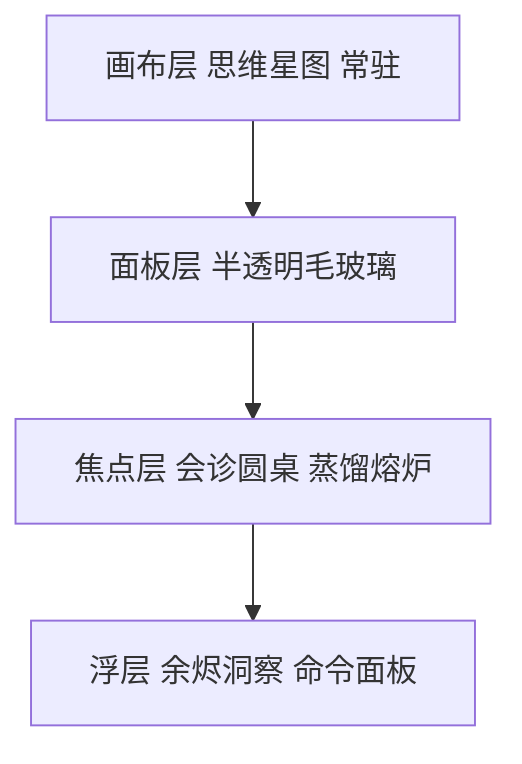
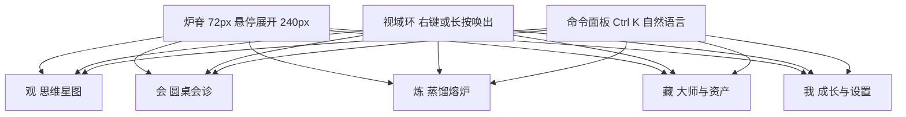

# 自我提升的思想熔炉 · UI 设计规范

Feature Name: thought-forge-workbench
Updated: 2026-09-14

## 设计立场

这个产品的界面要回答的问题不是「数据在哪里」，而是「我的思考正在发生什么」。因此它拒绝三样东西：拒绝仪表盘式的卡片网格，拒绝把功能平铺成标签页，拒绝把大师做成聊天头像列表。它采用一套有主张的隐喻体系，让每一次使用都像在操作一座正在燃烧的炉子。

四条设计原则：

1. 空间连续优先。整个应用是一个连续空间，不是一组页面。切换境界时，底层的思维网络保持可见并平滑变形，不做整页跳转。
2. 状态外显。炉温、激活度、衰减、冲突这些内在状态全部有视觉表现，用户不用点开就知道系统的健康度。
3. 一图胜千表。统计不用饼图和柱状图堆砌，改用年轮、星云、经纬这类有隐喻的可视化。
4. 克制而温热。暗色为主，光照是唯一的装饰语言。不滥用渐变和发光，只在「有热量」的地方发光。

## 核心创意：熔炉即界面

传统做法是把思维网络做成一个页面。本设计把它做成**画布层**。所有其他界面都是浮在这层画布之上的半透明面板。

这带来三个直接好处：任何时候都能看到自己的思考版图；会诊时被引用的大师框架会在背景中亮起，形成「思考正在联网」的实感；切换境界时画布只做视点变换，不做重载，用户永远不丢失位置感。



## 视觉语言：墨与火

两套材质构成全部视觉：墨代表知识与思考的沉淀，火代表激活与提炼的过程。界面中所有静态内容用墨的表现方式，所有动态内容用火的表现方式。

### 色彩

提供两套完整主题，共用令牌名，切换不改变任何布局与尺寸。默认「窑变」，暗色，来自烧窑的意象；另一套「素瓷」，明色，来自白瓷的意象。

#### 窑变（暗色，默认）

| 令牌 | 值 | 用途 |
|---|---|---|
| `bg-0` | `#0E0C0B` | 窑底，最深处 |
| `bg-1` | `#17130F` | 炉壁，主背景 |
| `bg-2` | `#211B16` | 陶土，浮起表面 |
| `text-1` | `#FCF7F0` | 宣纸，主文本 |
| `text-2` | `#D6CBBC` | 次级文本 |
| `text-3` | `#A2947F` | 弱化文本与元数据 |
| `ember` | `#E2703A` | 炭火，主强调色 |
| `ember-bright` | `#FF9A5A` | 明火，激活与焦点 |
| `ash` | `#7A7066` | 灰烬，禁用与衰减 |

暗色主题的可读性底线：正文对比度不低于 12:1，次级文本不低于 7:1，元数据不低于 4.5:1。界面中不出现低于 4.5:1 的文字。

#### 素瓷（明色）

| 令牌 | 值 | 用途 |
|---|---|---|
| `bg-0` | `#F3EDE3` | 素坯，最底层 |
| `bg-1` | `#FBF8F3` | 釉面，主背景 |
| `bg-2` | `#FFFFFF` | 白瓷，浮起表面 |
| `text-1` | `#221C16` | 墨，主文本 |
| `text-2` | `#574E44` | 次级文本 |
| `text-3` | `#857A6C` | 弱化文本与元数据 |
| `ember` | `#B84E22` | 炭火，主强调色 |
| `ember-bright` | `#D4661F` | 明火，激活与焦点 |
| `ash` | `#A79C8E` | 灰烬，禁用与衰减 |

明色下一律改用暗色阴影替代发光，避免糊成一片。环境光强度降为暗色主题的四成，画布节点描边改用加深的层次色。工具栏提供一键切换，位置固定在右上角，切换即时生效且不重载画布。

### 层次色

道法术气器势六层各有一色，全局统一，画布节点、大师徽记、连线、标签全部沿用。

| 层次 | 名 | 窑变值 | 素瓷值 | 气质 |
|---|---|---|---|---|
| 道 | 玄青 | `#7C8CF8` | `#4B5BD6` | 冷、远、深 |
| 法 | 松绿 | `#3FBF9F` | `#158F73` | 稳、清、结构 |
| 术 | 赭金 | `#E8A33D` | `#B4761A` | 实、亮、可操作 |
| 气 | 朱砂 | `#E4564A` | `#C63225` | 烈、暖、有生命 |
| 器 | 藤紫 | `#A98BE0` | `#7B4FD1` | 巧、利、可放大 |
| 势 | 天青 | `#46C2D6` | `#0E7C8F` | 轻、快、顺势 |

颜色之外每个层次还带一个几何标记，供高对比模式与色觉障碍用户区分：道为点、法为方、术为三角、气为波纹、器为十字、势为双箭。

### 字体

| 用途 | 字体 | 说明 |
|---|---|---|
| 思考正文与大师原声 | 思源宋体 | 衬线，行高 1.8，字距略放，读起来像在读文献 |
| 界面骨架 | 思源黑体 | 无衬线，克制的字重层次 |
| 元数据与 ID | JetBrains Mono | 等宽，用于时间、哈希、编号 |

字号阶梯 12 / 13 / 14 / 16 / 20 / 26 / 34 / 46。大师发言一律用宋体 16 至 20，与界面文字明确区隔，让「别人的话」和「系统的话」在视觉上是两种东西。

### 材质与光照

只有三处允许发光：被激活的节点、正在发言的大师、正在运行的蒸馏阶段。发光半径与强度直接映射真实数值，激活度越高越亮，衰减后逐渐转灰。面板使用 12 至 20 像素模糊的毛玻璃，边缘是 1 像素的极淡暖色描边，模拟炉壁透出的火光。

### 动效

| 令牌 | 值 | 用途 |
|---|---|---|
| `dur-fast` | 120ms | 悬停、按下 |
| `dur-base` | 240ms | 面板进出、状态切换 |
| `dur-slow` | 480ms | 视点变换、场景过渡 |
| `dur-ambient` | 1200ms+ | 炉体呼吸、余烬飘浮 |
| `ease-liquid` | `cubic-bezier(0.22, 1, 0.36, 1)` | 默认，像液体 |
| `ease-ember` | `cubic-bezier(0.34, 1.4, 0.64, 1)` | 火花弹起，克制使用 |

运动的两条语义规则：激活是热的，表现为向外扩散的暖光；遗忘是冷的，表现为缓慢褪色并轻微去饱和。界面中不出现卡通弹跳。

### 声音

默认静音，可在设置中开启。开启后只有三种声音：节点激活的细微噼啪、大师发言结束的一声低钟、蒸馏出炉的一声金属共鸣。声音的作用是让长时间使用的节奏感更强，不是装饰。

## 导航模型：炉脊与视域环

放弃左侧功能列表式的侧栏，改用**炉脊**：一条 72 像素宽的窄脊，贴在左侧，悬停展开到 240 像素显示文字。脊上五个印记对应五个境界。印记下方有一条细弱的光带，表示该境界近期活跃度，有新内容时该境界的印记底部会有一点余烬微光。



三个入口各有分工：炉脊用于明确跳转，视域环用于不打断心流的快速切换，命令面板用于直接说人话，例如「把今天关于定价的念头和芒格碰一下」。

## 境界一 · 观（思维星图）

主界面，常驻画布。节点按领域聚成星云，位置由力导向布局决定，用户拖动过的节点会被钉住不再移动。

节点视觉编码：大小映射激活度，颜色映射层次，亮度映射最近唤起时间，形状映射节点类型（念头为圆、判断为方、框架为六边形、原则为印章形、问题为问号缺口、证据为菱形）。连线粗细映射权重，颜色映射关系类型，支持为暖白、冲突为朱砂、衍生为松绿、类比为玄青、应用为赭金。

```
┌────┬────────────────────────────────────────────┬──────┐
│    │  ⌘K  搜索节点 · 提问 · 说人话              │ 炉温 │
│ 炉 │                                            │      │
│ 脊 │          ·        ●          ·             │  ██  │
│    │      ·     ╲     │     ╱        ·           │  ██  │
│ 观 │     ●───────●────┼────●────────●           │  █   │
│ 会 │      ·     ╱     │     ╲                    │  █   │
│ 炼 │          ·        ●          ·             │      │
│ 藏 │                                            │ 32°  │
│ 我 │  ┌ 待裁决 3 ┐   ┌ 新入炉 12 ┐              │      │
└────┴────────────────────────────────────────────┴──────┘
```

三级视点：星云级只显示领域聚类与总量，星图级显示节点与连线，心核级聚焦单个节点并展开其全部连线与来源记录。滚轮缩放即在这三级间平滑过渡，不做跳变。

右侧竖立**炉温**：全系统认知活跃度的合成指标，由激活度总和、近日采集量、会诊频次加权而成。它是本设计的招牌元素，炉温直接影响界面环境光的强度，冷炉暗淡、热炉温暖，让用户一眼感知自己最近的状态，而不是去读一个数字。

底部左区是**待裁决**，列出存在支持与冲突并存的节点；右区是**新入炉**，滚动展示最近投入的念头。两者都可点击直接进入处理。

键盘等价：`J` `K` 在节点间移动，`Enter` 进入心核，`Space` 以该节点为种子发起会诊。

## 境界二 · 会（圆桌会诊）

这是全产品的情绪高点。俯视圆桌以轻微透视呈现，大师坐在圆周的席位上，每人一枚由姓名首字与领域纹样合成的徽记。问题以一颗发光核心悬浮在桌面正中。

```
┌────┬────────────────────────────────────────────┬──────┐
│    │  问题：写字楼底商该不该转做体验业态         │ 进度 │
│ 炉 │                                            │      │
│ 脊 │        ◉ 芒格          ◉ 德鲁克            │ ① ●  │
│    │         ╲   ●核心●   ╱                     │ ② ○  │
│ 观 │      ◉ 稻盛和夫 ─── ◉ 纳瓦尔               │ ③ ○  │
│ 会 │         ╱            ╲                     │      │
│ 炼 │        ◉ 弗兰克尔                          │ 分歧 │
│ 藏 │                                            │  2   │
│ 我 │  ┌ 记录全文 ──────────────────────────┐   │      │
└────┴────────────────────────────────────────────┴──────┘
```

三个阶段的动画语义不同。第一轮独立作答：每位大师的席位向内投出一束光，填充自己那段扇形，光束之间互不交叠，视觉上强调「各自独立」。第二轮交叉质询：光束变为弧线并相互穿插，出现交锋感。收敛阶段：所有光束汇向中央，凝成一颗晶核，即结论。

冲突有专门的表现：两位大师意见相左时，两条光弧在桌面交点处凝成一颗朱砂色珠子，标注分歧主题。珠子数量即分歧数量，点击展开双方依据。

大师徽记有独立身份：每个大师包带一份视觉配置，包含纹样、主色与徽记字形。稻盛和夫的徽记偏赭金用印章质感，芒格偏玄青用格栅质感，让大师在视觉上真正是「不同的人」，而不是同一套头像换名字。

控制条做成录音机形态：可播放、暂停、拖动时间轴回看某一轮，也可以「离席」，让会诊在后台跑完再通知。会诊结束后结论晶核落入思维网络，成为新节点，与本次引用的大师框架自动连线。

### 骑士团选角与换批

圆桌席位来自候选池，因此有两组关键交互。

选角策略是三档开关，放在圆桌左上方：稳妥、碰撞、意外。切换策略时席位不立即更换，而是先以虚线预览将入席的新面孔，用户在预览上确认后才真正换人。这样避免误触把一场进行中的会诊打断。

换批做成圆桌外圈的一个旋转把手。拖动把手时候选池里的大师徽记沿外圈滑动经过，松手即完成换批。层次覆盖不变，被用户钉住的席位固定在原位不参与旋转，钉住的席位带一枚小锁标记。每完成一次换批，右侧进度区增加一个阵容标记，用户可以在阵容之间来回切换对比，同一个问题由不同的人谈会得到不同的判断。

候选池的规模在换批界面里可见：外圈之外还有一层更淡的虚影，代表池中未入席的大师，用户能直观感知骑士团有多大、还有谁没见过。

## 境界三 · 炼（蒸馏熔炉）

蒸馏是六阶段流水线，界面用一具剖面炉体逐段呈现，让抽象流程变得可以观看。

| 阶段 | 视觉表现 |
|---|---|
| 0 整体理解 | 原料落入炉膛，上方浮出蓝图叠层，等待用户确认骨架，未确认前不加热 |
| 1 五路提取 | 五支提取臂亮起，从原料中抽出五色光流，分别流向框架、原则、案例、反例、术语 |
| 1.5 三重验证 | 三层筛网依次过滤，未通过候选化作炉渣落入托盘，每粒渣标注排除原因 |
| 2 生成单元 | 通过的候选在炉底凝成锭，每锭可展开查看触发条件、步骤、机制、边界四要素 |
| 3 技能地图 | 锭之间自动生成连线，形成该书的技能网络预览 |
| 4 压力测试 | 诱饵题被投入，观察触发是否准确，未通过的锭回炉 |
| 5 交付安装 | 出炉动画，锭飞入大师库，落地为可调用的席位 |

弃料托盘是本设计的一个态度表达：系统明确展示「什么被淘汰了、为什么」。这比只展示成功结果更可信，也让用户能校准蒸馏质量。

## 境界四 · 藏（大师与资产）

三个视图用一把开关切换，避免堆叠成三级菜单。

**大师架子**：大师以书脊形态竖排，颜色来自其领域，可抽出一本展开成完整身份卡，包含能力圈边界、判断框架、提问方式、决策规则、表达风格与盲区。空白区域显式展示领域与层次的覆盖矩阵，缺哪个格子就推荐蒸谁，把覆盖矩阵做成可点击的采购清单。

**资产图谱**：已安装 Skill 与 AI 平台以马赛克网格呈现，面积映射使用频次，颜色映射领域，失效的 Skill 显示为裂纹陶片并标注待修复。顶部一行汇总：总数、覆盖领域数、启用比例、近三十天变动。

**知识地形**：知识库用树状图呈现主题分布，面积映射文档量，颜色映射领域。时间趋势用年轮表现，每一圈代表一段时间，圈层厚度对应新增量，比折线图更符合「我的知识在生长」的心理感受。

## 境界五 · 我（成长与设置）

**演化长河**：同一主题的多次结论沿一条水平河流排布，支流代表修正与转向，河宽代表投入的思考量。点击任一节点并列对比当时的结论与现在的结论，这是用户确认自己真的在进步的地方。

**个人原则**：被连续采纳三次的结论自动升格为原则，以印章形态陈列。印章可点击查看它从哪些会诊演化而来，形成一条可追溯的谱系。

**年轮概览**：激活度最高的节点、增长最快的领域、新增连线数、已沉淀原则数四个指标围绕一圈年轮排布，中心是炉温。

**自我蒸馏**：累计二十条记录后解锁，入口做成一面铜镜。启动后系统基于历史记录蒸出用户本人大师包的初稿，用户逐条确认后，这个「你」的席位会出现在之后每一次会诊中，作为第七位与会者，用来对照「现在的你」与「当时的你」。

设置页包含采集能力逐项开关、主动助学开关与规则、模型平台配置、主题切换、数据导出与清除。所有联网能力默认关闭，每项开启时要求一次显式确认并展示用途说明。

## 主动助理：余烬

主动推送不做通知中心，不走系统弹窗。它表现为画布边缘的一簇余烬，安静地亮着。点开后洞察以漂浮卡片进场，按性质分色：发现关联为赭金，发现冲突为朱砂，发现盲区为玄青。

每张卡片给出关联对象与简要理由，并提供三个动作：采纳、忽略、转为会诊。转为会诊会把该洞察直接送入圆桌，这是从「被动接收」到「主动深挖」的桥。

余烬有节制的表现很重要。它会随时间变暗，长时间未处理也不催促，避免变成又一个制造焦虑的消息红点。

## 关键组件

**节点卡 Node Card**：出现在心核级视点与搜索结果中。展示类型标记、内容、层次色带、来源、激活度条与直接连线数量。

**大师徽记 Master Sigil**：由首字、领域纹样与层次色环三层构成，支持 24 至 96 像素多尺寸，是大师在各处统一的人格标识。

**结论晶核 Conclusion Core**：会诊产出的实体卡，展示结论一句话、分歧数、参与大师徽记、采纳状态。可一键沉入网络或转为原则候选。

**火花 Spark**：节点激活时沿连线传播的粒子，是全局反馈元件。在降低动态效果模式下自动替换为一次颜色脉冲。

**筛网 Sieve**：蒸馏验证的可视化元件，三层可叠加，用来表现候选的逐层过滤。

**命令面板**：`Ctrl K` 唤出，支持自然语言指令与结构化指令两种输入，是重度用户的主通道。

## 状态与边界

冷炉空态：首次启动时炉体是冷的，只有一处「点燃炉火」。点火流程就是引导：先选首批大师，再确认采集范围，最后投入第一个念头。空态本身是一段仪式，不做空白页配插画。

加载态：不使用骨架屏占满界面。长任务一律在炉体上有具体表现，蒸馏显示炉温上升，扫描显示光流推进，让等待有信息量。

错误态：错误以裂纹陶片的形态出现，附稳定错误码与可执行动作。模型调用失败不打断会诊，只把该席位标为未应答，其余结果照常呈现。

离线态：炉温环外加一圈虚线，明确表示外部能力不可用，但历史上大师、记录、图谱、统计全部保持可读可搜。

权限态：剪贴板或窗口采集被系统拒绝时，对应炉口显示闭合状态并给出前往系统设置的指引，不影响其他能力。

## 无障碍

降低动态效果开启时，取消粒子与背景呼吸，保留状态色变与位置变化。高对比模式用层次几何标记替代纯色区分。画布提供等效的列表视图与大纲视图，所有图形操作都有键盘路径与菜单路径。图谱对屏幕阅读器暴露为可遍历的树结构，节点朗读类型、内容、层次与激活度。所有可点击元素不小于 32 像素，重点操作不小于 44 像素。焦点环使用暖色高对比描边，在暗色与浅色两套主题下都清晰可见。

## 设计令牌

| 类别 | 令牌与值 |
|---|---|
| 间距 | 4 基准网格，常用 8 / 12 / 16 / 24 / 32 / 48 |
| 圆角 | 4 精确、10 卡片、20 面板、999 圆 |
| 描边 | 1px `rgba(226,112,58,0.14)` 暖色描边 |
| 阴影 | 只用暖色阴影，`0 8px 32px rgba(0,0,0,0.45)` |
| 模糊 | 面板 12px，浮层 20px |
| 字号 | 12 / 13 / 14 / 16 / 20 / 26 / 34 / 46 |
| 行高 | 界面 1.5，思考正文 1.8 |
| 动效 | 见上文令牌表，统一由 `motion.ts` 导出 |
| 层次色 | 道 `#7C8CF8` 法 `#3FBF9F` 术 `#E8A33D` 气 `#E4564A` 器 `#A98BE0` 势 `#46C2D6` |
| 对比度底线 | 暗色主题正文 ≥ 12:1，次级 ≥ 7:1，元数据 ≥ 4.5:1 |

## 自适应

基准分辨率 1440×900。1360 宽为设计下限，仍保持炉脊与画布。1024 至 1280 区间炉脊收为 56 像素纯图标，右栏折叠为抽屉。小于 1024 时进入单栏模式，炉温与余烬收进顶栏，画布退化为列表视图加图谱缩略图。窗口高度低于 720 时压缩垂直留白，不隐藏任何功能。

## 落地优先级与风险

先做观、会两个境界的可用版本，这两个构成产品核心价值。炼与藏在第二批，我需要、我放第三批。视觉系统从第一天就整体落地令牌与层次色，避免后期返工。

最大风险是把图谱做成「好看但没用」。缓解手段有三条：节点必须可操作且有明确下一步（待裁决、新入炉、转为会诊）；画布始终提供列表与大纲的等效视图；图谱上的关键动作都必须能通过命令面板完成，让重度用户有快通道。
